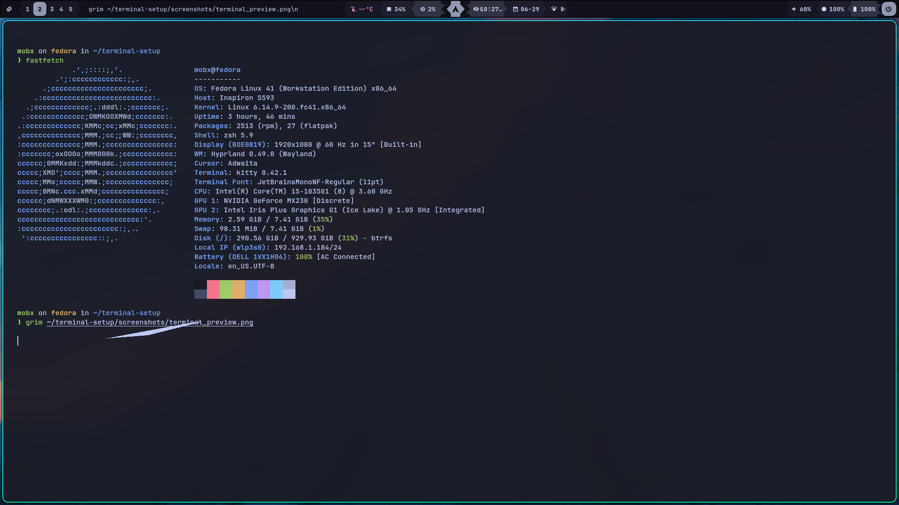

# 🧠 My Terminal Setup (ZSH + Starship + Kitty)

A minimal yet stylish terminal configuration built for speed, clarity, and aesthetic vibes 😎

## 🔧 Features

- ⚡ Fast ZSH shell powered by [Starship Prompt](https://starship.rs/)
- 🎨 Tokyo Night color scheme for Kitty
- 🧠 Useful aliases, keybindings, and plugins
- 💻 Nerd Font & emoji support
- 📸 Screenshot below

## 📸 Preview



# 🧠 My Terminal Setup (ZSH + Starship + Kitty)

A minimal yet stylish terminal configuration built for speed, clarity, and aesthetic vibes 😎

## 🔧 Features

- ⚡ Fast ZSH shell powered by [Starship Prompt](https://starship.rs/)
- 🎨 Tokyo Night color scheme for Kitty
- 🧠 Useful aliases, keybindings, and plugins
- 💻 Nerd Font & emoji support
- 📸 Screenshot below

## 📸 Preview


## 📁 Structure

myTerminalSetup/
├── kitty/
│ ├── kitty.conf
│ └── theme.conf
├── zsh/
│ └── .zshrc
├── starship/
│ └── starship.toml
├── screenshots/
│ └── terminal_preview.png
└── install.sh

## 🚀 Installation

```bash
git clone https://github.com/mobx2/myTerminalSetup.git

git clone https://github.com/mobx2/myTerminalSetup.git
cd myTerminalSetup
bash install.sh


🛠 What the Script Does

    Copies configuration files to the correct locations:

        ~/.config/kitty/kitty.conf

        ~/.config/kitty/theme.conf

        ~/.zshrc

        ~/.config/starship/starship.toml

    Installs JetBrainsMono Nerd Font if not already installed

    Checks if required tools are available:

        kitty

        zsh

        starship

## 📌 Notes

    You may need to restart your terminal for all changes to apply.

    Make sure your terminal is set to use JetBrainsMono Nerd Font for full icon support.

    If any tool is missing, the script will notify you to install it manually.

## ✅ Requirements

    ZSH

    Starship

    Kitty

    Nerd Font (JetBrainsMono recommended)

    Bash-compatible system (Linux, macOS)

```
